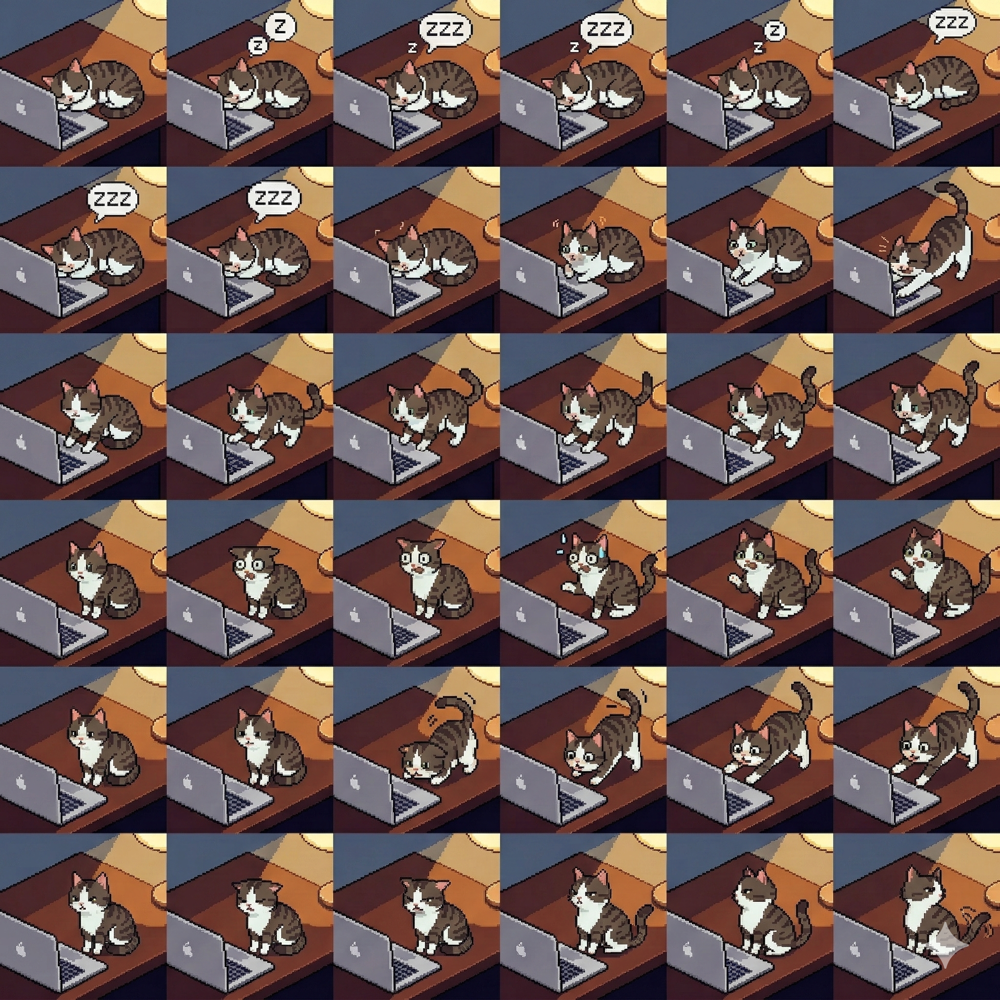

# Peon Pet

Your desktop coding companion — fully customizable, AI-generated, and reactive to your [Claude Code](https://docs.anthropic.com/en/docs/claude-code) sessions.

## Install

```bash
git clone https://github.com/PeonPing/peon-pet.git
cd peon-pet
npm install
npm start
```

To auto-start at login:

```bash
./install.sh    # install macOS LaunchAgent
./uninstall.sh  # remove it
```

Requires macOS, Node.js 18+, and [Peon-Ping](https://peonping.com) for event hooks.

---

## Make Your Own Pet

Peon Pet ships with 4 built-in characters, but the real point is **making your own**. Use any AI image generator (Gemini, DALL-E, Midjourney) to create a custom sprite atlas, drop it in, and your pet is whatever you want it to be.

Here's a cat character generated entirely by Gemini — from prompt to desktop in minutes:

<div align="center">

<br/>
<em>A custom cat pet — 6 animations, 36 frames, generated with a single Gemini prompt.</em>
</div>

### How to create a custom character

1. **Generate a sprite atlas** — use the prompt template in [docs/sprite-atlas-prompt.md](docs/sprite-atlas-prompt.md). Swap out the character description for anything you want: a cat, a robot, your company mascot, whatever.

2. **Follow the grid spec** — 6 columns × 6 rows, 512×512px per frame (3072×3072px total PNG):

   | Row | Animation | When it plays |
   |-----|-----------|---------------|
   | 0 | Sleeping | Idle loop — no active sessions |
   | 1 | Waking | Session starts |
   | 2 | Typing | You submit a prompt |
   | 3 | Alarmed | Permission request or context limit |
   | 4 | Celebrate | Task completes |
   | 5 | Annoyed | Tool failure |

3. **Drop it in** — copy your character folder to `~/Library/Application Support/Peon Pet/characters/your-name/` with a `sprite-atlas.png` and `character.json`. See [CONTRIBUTING.md](CONTRIBUTING.md) for the full file structure.

4. **Switch to it** — right-click the pet and pick your character. No restart needed.

---

## How It Works

Peon Pet reads a state file written by [Peon-Ping](https://peonping.com) hooks. When Claude Code fires events (prompt submit, task complete, permission request), the hook writes to `~/.claude/hooks/peon-ping/.state.json`. Peon Pet polls this file at 200ms intervals and triggers the matching animation.

A separate Python hook (`scripts/session-hook.py`) tracks session lifecycle across main sessions and sub-agents, writing to `~/.config/peon-pet/sessions.json`.

```
Claude Code event
  -> peon-ping hook writes .state.json
  -> peon-pet polls, triggers animation + session dot update
```

### Session Dots

Up to 10 dots appear above the character, one per tracked session:

| State | Condition | Appearance |
|---|---|---|
| **Hot** | Event within last 30s | Bright green, pulsing |
| **Warm** | Last event 30s–2min ago | Dim green, static |
| **Gone** | Ended or >10min idle | Removed |

Hover a dot to see the project folder and status.

---

## Demo

<div align="center">
<video src="https://github.com/PeonPing/peon-pet/raw/master/docs/demo.mp4" autoplay loop muted playsinline width="480"></video>
</div>

> If the video doesn't render above, see [docs/demo.mp4](docs/demo.mp4) directly.

---

## Built-in Characters

| Character | Description |
|---|---|
| **Sleeping Orc** | Pixel art orc at a desk, snoring while idle |
| **Laptop Guy** | Programmer hunched over a laptop (default) |
| **Standing Orc** | Full-body orc with chroma-key background |
| **Mimi** | AI-generated cat character |

Switch from the right-click menu. The change is instant.

## Controls

Right-click the pet or dock icon:

- **Sound On/Off** — toggle Peon-Ping audio
- **Volume** — 10% to 100% in steps
- **Character** — switch between available characters
- **Sessions** — view tracked sessions list
- **Sessions Panel** — toggle inline sidebar
- **Hide/Show Pet** — toggle visibility without quitting
- **Quit** — exit

## Configuration

Settings persist in `~/.config/peon-pet/config.json`:

```json
{
  "character": "laptop-guy",
  "volume": 0.3,
  "showSessions": false,
  "window": { "w": 150, "h": 150, "x": 1770, "y": 850 }
}
```

## Session Hook Setup

To enable full session tracking (including sub-agents):

```bash
python3 scripts/install-session-hook.py
```

Or manually add `scripts/session-hook.py` as a Claude Code hook for all events.

## Development

```bash
npm run dev       # start with DevTools detached
npm test          # run Jest tests
npm test:watch    # watch mode
```

### Simulate Events

Trigger an animation without a real Claude Code session:

```bash
python3 -c "
import json, time, os, uuid
f = os.path.expanduser('~/.claude/hooks/peon-ping/.state.json')
try: state = json.load(open(f))
except: state = {}
state['last_active'] = {
  'session_id': str(uuid.uuid4()),
  'timestamp': time.time(),
  'event': 'Stop'
}
json.dump(state, open(f, 'w'))
"
```

Valid events: `SessionStart`, `SessionEnd`, `Stop`, `UserPromptSubmit`, `PermissionRequest`, `PostToolUseFailure`, `PreCompact`

## Tech Stack

- **Electron 40** — desktop window management
- **Three.js r183** — WebGL rendering with custom GLSL shaders
- **Node Canvas** — dock icon generation
- **Jest 29** — test suite
- **Python 3** — session tracking hook

## Contributing

See [CONTRIBUTING.md](CONTRIBUTING.md) for how to submit custom characters.

## License

MIT
